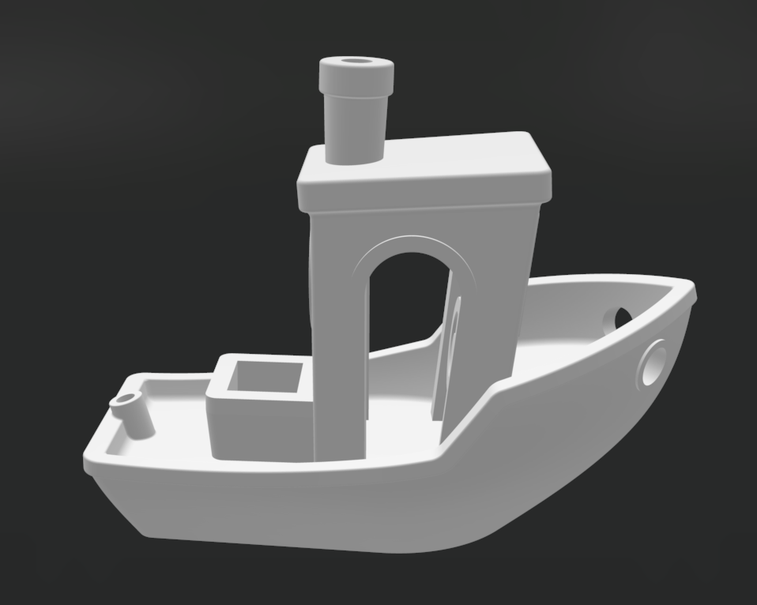

# gpu-slicer

A demo 3D slicer that works on manifold meshes, and a few
extras ([clipper.hpp](https://github.com/DanielToby/gpu-slicer/blob/main/slicer/src/slicer/clipper.hpp)...) that I wrote
mistakenly along the way but didn't have the heart to remove.




### This Project

The goal of this project is to use a 3D slicing pipeline to benchmark different spatial index implementations, including GPU-accelerated ones.

### How to Run

This project only requires C++20 and CMake >=3.29 to run. The tests are under target `slicer_tests`.

### Results

```
Num triangles: 225154
Num slices: 96

Slice Operations:
[1: query spatial index] time: 2097μs
[2: intersect triangles] time: 439μs
[3: build adjacency list] time: 451μs
[4: get slice outlines] time: 435μs
[5: identify windings] time: 44μs
[6: get outline hierarchy] time: 62μs
[7: get polygons] time: 15μs

Total Run:
[build spatial index (none)] time: 1ms
[load stl] time: 207ms
[slice (no spatial index)] time: 340ms
```

Without a spatial index, querying for triangles intersecting Z takes up most of the slicing time.

### The Spatial Index

This is passed into the slice pipeline to make showing the performance differences easier. So far I only have the
[greedy implementation](https://github.com/DanielToby/gpu-slicer/blob/main/slicer/src/spatial_index/no_spatial_index.cpp).

```C++
class I_SpatialIndex {
public:
    virtual ~I_SpatialIndex() = default;

    //! Constructs the spacial index.
    virtual void build(const std::vector<Triangle3D>& triangles) = 0;

    //! Returns all triangles intersecting zPosition.
    [[nodiscard]] virtual std::vector<Triangle3D> query(float zPosition) const = 0;

    //! The BBox of the index.
    [[nodiscard]] virtual BBox3D AABB() const = 0;
};
```

### The Slicer

See [main.test.cpp](https://github.com/DanielToby/gpu-slicer/blob/main/slicer/src/slicer/main.test.cpp) for the demo taking an stl file and writing SVGs:

```C++
const auto triangles = slicer::loadStl("/Users/daniel.toby/Desktop/3DBenchy.stl");
auto noSpatialIndex = slicer::NoSpatialIndex{};
noSpatialIndex.build(triangles);

auto slices = slicer::slice(noSpatialIndex, /* thickness = */.5);

auto bbox = noSpatialIndex.AABB();
auto dimensions = slicer::BBox2D{slicer::toVec2(bbox.min), slicer::toVec2(bbox.max)};
for (auto i = 0; i < slices.size(); i++) {
    slicer::writeSVG(dimensions, slices[i].polygons, "<i.svg>");
}
```

See [slicer.cpp](https://github.com/DanielToby/gpu-slicer/blob/main/slicer/src/slicer/slicer.cpp) for a simple breakdown of the core components of a 3D slicer:

```C++
std::vector<Slice> slice(const I_SpatialIndex& mesh, float thickness) {
    std::vector<Slice> result;

    // For timing each slicing operation at each slice height.
    timing::LabelToAccumulatedDuration<std::chrono::microseconds> accumulatedDurations;

    auto time = timing::Clock::now();

    for (const auto& sliceHeight : getSliceHeights(mesh.AABB(), thickness)) {
        auto triangles = mesh.query(sliceHeight);
        timing::timeAndStore(time, "1: query spatial index", accumulatedDurations);

        auto segments = intersect(triangles, sliceHeight);
        timing::timeAndStore(time, "2: intersect triangles", accumulatedDurations);

        auto adjacencyList = getManifoldAdjacencyList(segments);
        timing::timeAndStore(time, "3: build adjacency list", accumulatedDurations);

        auto outlines = getSliceOutlines(adjacencyList);
        timing::timeAndStore(time, "4: get slice outlines", accumulatedDurations);

        auto relativeOutlines = identifyWindings(outlines);
        timing::timeAndStore(time, "5: identify windings", accumulatedDurations);

        auto outlineHierarchy = OutlineHierarchy{std::move(relativeOutlines)};
        timing::timeAndStore(time, "6: get outline hierarchy", accumulatedDurations);

        auto polygons =  outlineHierarchy.getPolygons();
        timing::timeAndStore(time, "7: get polygons", accumulatedDurations);

        result.push_back({{polygons.begin(), polygons.end()}, sliceHeight});
    }

    timing::logTimings("Slice Operations", accumulatedDurations, result.size());

    return result;
}
```

### Dependencies

- [stl_reader](https://github.com/sreiter/stl_reader/tree/6c7615759269a2e6958d04d4d6a4982b6b0da902)
- [catch2](https://github.com/catchorg/Catch2/tree/b3fb4b9feafcd8d91c5cb510a4775143fdbef02f)
